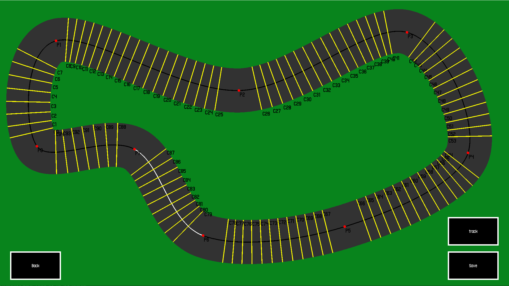

# RL DQN Racing AI

## Overview
RL DQN Racing AI is a car racing project where an AI, trained using Deep Q-Networks (DQN), competes against a human player. The project includes:
- AI opponents trained Deep Q-Networks (DQN)
- Custom track creation
- Playable racing experience

## Play 
Race against the AI on pre-built or custom tracks.

## Training
The AI learns to drive by trial and error, improving over time.

## Track Editor
Manually design race tracks using the track editor

## Technologies Used
- Python
- Pygame
- Pytorch

## Future Improvements
- Adjustable difficulty
- Better UI and graphics